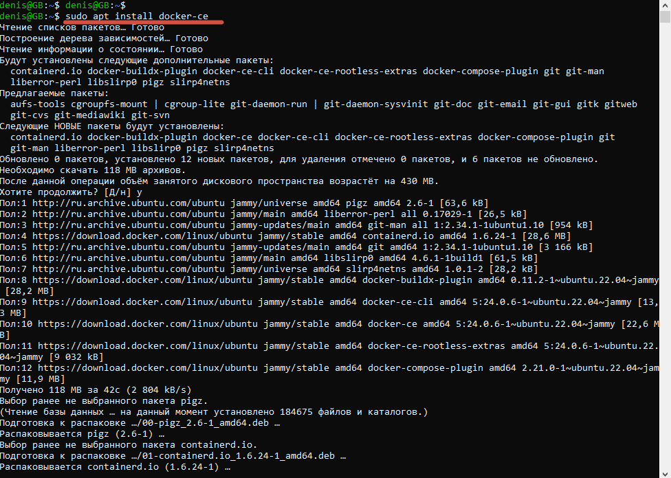

Урок 3. Введение в Docker

1 - устанавливаем Докер
2 - тестируем.
3 - тестируем команды.
4 - Хранение данных в контейнерах Docker: Руководство с пояснениями

### 1 - устанавливаем Докер

### 2 - тестируем.

### 3 - тестируем команды.

### 4 - Хранение данных в контейнерах Docker: Руководство с пояснениями

