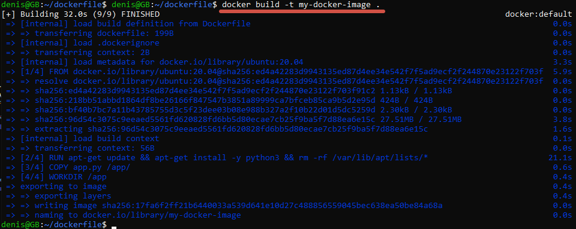
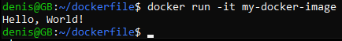

Задание: необходимо создать Dockerfile, основанный на любом образе (вы в праве выбрать самостоятельно).
В него необходимо поместить приложение, написанное на любом известном вам языке программирования (Python, Java, C, С#, C++).
При запуске контейнера должно запускаться самостоятельно написанное приложение.

mkdir dockerfile

cd dockerfile/

nano Dockerfile

### добавляем код в файл

FROM ubuntu:20.04

RUN apt-get update && apt-get install -y python3 && rm -rf /var/lib/apt/lists/*

COPY app.py /app/

WORKDIR /app

CMD ["python3", "/app/app.py"]

### собираем контейнер

docker build -t my-docker-image .

### Запускаем его

docker run -it my-docker-image

