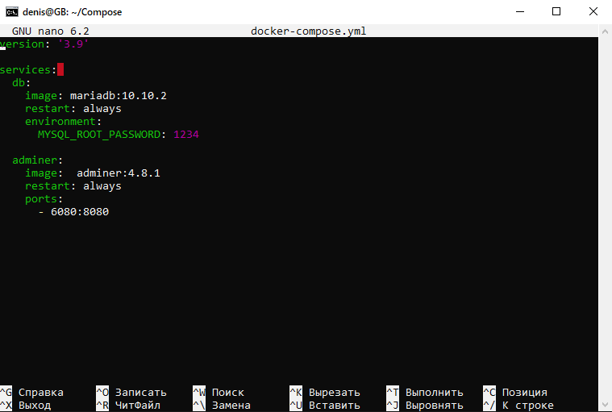
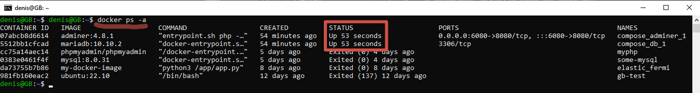

1. создать сервис, состоящий из 2 различных контейнеров: 1 - веб, 2 - БД (compose)

Задание со звездочкой - повышенной сложности..

2. _** не обязательно._ Необходимо создать 3 сервиса в каждом окружении (dev, prod, lab)

3. _** не обязательно._ По итогу на каждой ноде должно быть по 2 работающих контейнера

https://github.com/Terekhov-A-S/Containerization-Seminar_5
Для тех кому интересно про Сфарм

4. выводы зафиксировать

## РЕШЕНИЕ

1.
mkdir Compose/

cd Compose/

nano docker-compose.yml

и пишем в файл

теперь сохраняем и запускаем

docker-compose up

проверяем

docker ps -a

