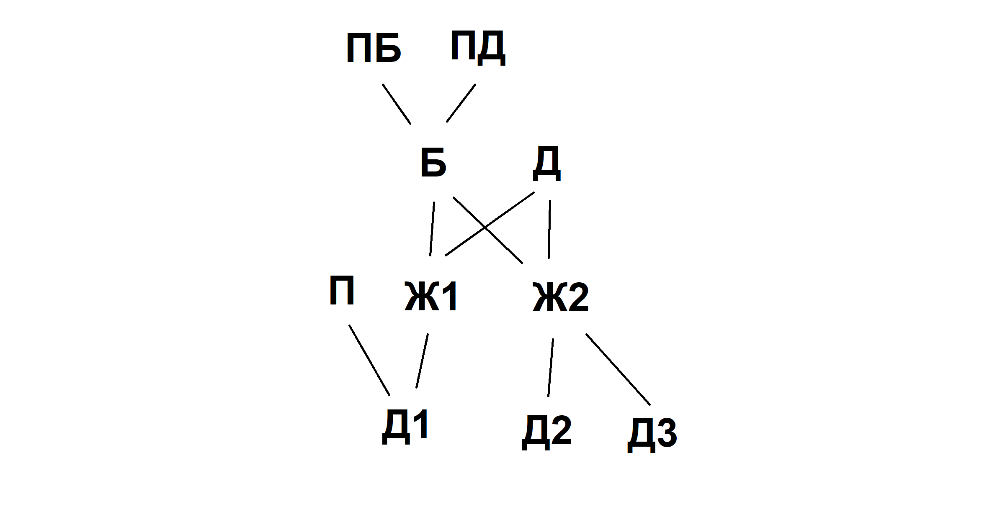

# Разработка приложения на C#
### Урок 1. Классы и ООП

**Задание:** Доработайте приложение генеалогического дерева таким образом чтобы программа выводила на экран близких родственников (жену/мужа) и братьев/сестёр определённого человека. Продумайте способ более красивого вывода с использованием горизонтальных и вертикальных черточек.

З.Ы. Я не стал добавлять черточки, я просто текстом описываю, кто это, брат/сестра(без разделения на сводных), муж/жена
    
[Домашнее задание 1 - Классы и ООП](../../Seminars/Seminar1/Program.cs)