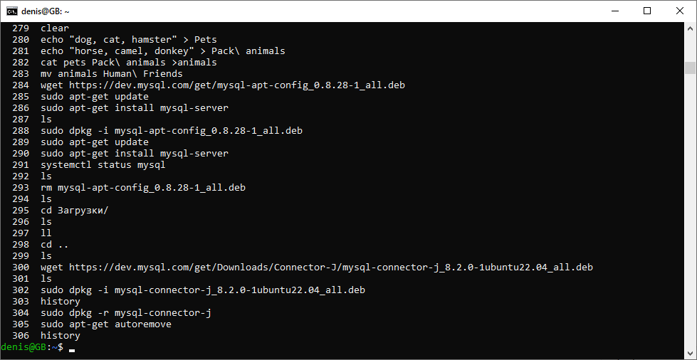
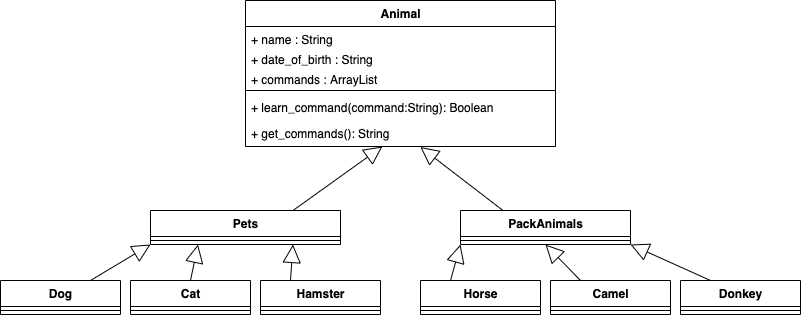

# GB_final_12.2023
Final work at first part of education

# `Итоговая аттестация. Практическое задание`

## `Информация о проекте`
Необходимо организовать систему учета для питомника, в котором живут домашние и вьючные животные.

## `Задание:`

### 1. Использование команды cat в Linux.
- Создать два текстовых файла: "Pets"(Домашние животные) и "Pack animals"(вьючные животные), используя команду `cat` в терминале Linux. В первом файле перечислить собак, кошек и хомяков. Во втором — лошадей, верблюдов и ослов. 
- Далее объединить содержимое этих двух файлов в один и просмотреть его содержимое. 
- Затем переименовать получившийся файл в "Human Friends"

мы можем использовать cat и затем заполнить файл уже изнутри, но проще создать и наполнить его командой **echo "sometext" > somefile**

> *echo "dog, cat, hamster" > pets*

> *echo "horse, camel, donkey" > Pack\ animals*

> *cat pets Pack\ animals > animals*

> *mv animals Human\ Friends*

### 2. Создать директорию, переместить файл туда.

> *mkdir testdir*

> *mv Human\ Friends testdir/*

> *ls*

### 3. Подключить дополнительный репозиторий MySQL. Установить любой пакет из этого репозитория.

Обновляем информацию о пакетах чтобы убрать лишнее:

> *sudo apt update*

Скачиваем конфигуратор mysql:

> *wget https://dev.mysql.com/get/mysql-apt-config_0.8.28-1_all.deb*

устанавливаем компоненты mysql с помощью конфигуратора:

> *sudo dpkg -i mysql-apt-config_0.8.28-1_all.deb*

В процессе установки жмем Ок, чтобы выполнить полную установку

Обновляем информацию о пакетах и видим подключенный репозиторий mysql:

> *sudo apt-get update*

Устанавливаем mysql-server:

> *sudo apt-get install -y mysql-server*

Проверяем результат установки:

> *systemctl status mysql*

### 4. Установить и удалить deb-пакет с помощью dpkg.

> *wget https://dev.mysql.com/get/Downloads/Connector-J/mysql-connector-j_8.2.0-1ubuntu22.04_all.deb*

> *sudo dpkg -i mysql-connector-j_8.2.0-1ubuntu22.04_all.deb*

> *sudo dpkg -r mysql-connector-j*

> *sudo apt-get autoremove*

### 5. Выложить историю команд в терминале ubuntu.

### 6. Нарисовать диаграмму, в которой есть родительский класс "Животные", и два подкласса домашние животные и вьючные животные, в составы которых в случае домашних животных войдут классы: собаки, кошки, хомяки, а в класс вьючные животные войдут: лошади, верблюды и ослы).

### 7. Работа с MySQL (Задача выполняется в случае успешного выполнения задачи “Работа с MySQL в Linux. “Установить MySQL на вашу машину”)

#### 7.1 После создания диаграммы классов в 6 пункте, в 7 пункте база данных "Human Friends" должна быть структурирована в соответствии с этой диаграммой. Например, можно создать таблицы, которые будут соответствовать классам "Pets" и "Pack animals", и в этих таблицах будут поля, которые характеризуют каждый тип животных (например, имена, даты рождения, выполняемые команды и т.д.). 

#### 7.2 В ранее подключенном MySQL создать базу данных с названием "Human Friends".
 - Создать таблицы, соответствующие иерархии из вашей диаграммы классов.
 - Заполнить таблицы данными о животных, их командах и датами рождения.
 - Удалить записи о верблюдах и объединить таблицы лошадей и ослов.
 - Создать новую таблицу для животных в возрасте от 1 до 3 лет и вычислить их возраст с точностью до месяца.
 - Объединить все созданные таблицы в одну, сохраняя информацию о принадлежности к исходным таблицам.

[Cкрипт 7 задания](sql_script.sql)
   

### 8. Создать иерархию классов в Java, который будет повторять диаграмму классов созданную в задаче 6(Диаграмма классов) .

### 9. Написать программу на Java, которая будет имитировать реестр домашних животных. 

#### 9.1 Реализовать функциональность для добавления новых животных в реестр.

#### 9.2 Вывести список команд, которые может выполнять добавленное животное (например, "сидеть", "лежать").

#### 9.3 Добавить возможность обучать животных новым командам.

#### 9.4 Вывести список животных по дате рождения
#### 9.5 Реализовать консольный пользовательский интерфейс с меню для навигации между вышеуказанными функциями

### 10. Создать механизм, который позволяет вывести на экран общее количество созданных животных любого типа (Как домашних, так и вьючных), то есть при создании каждого нового животного счетчик увеличивается на “1”. 
